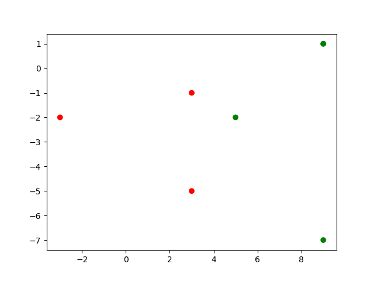
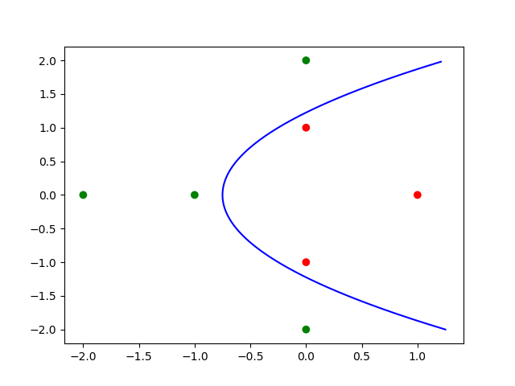
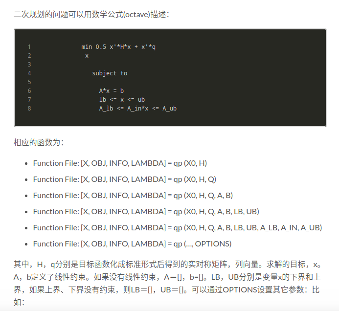
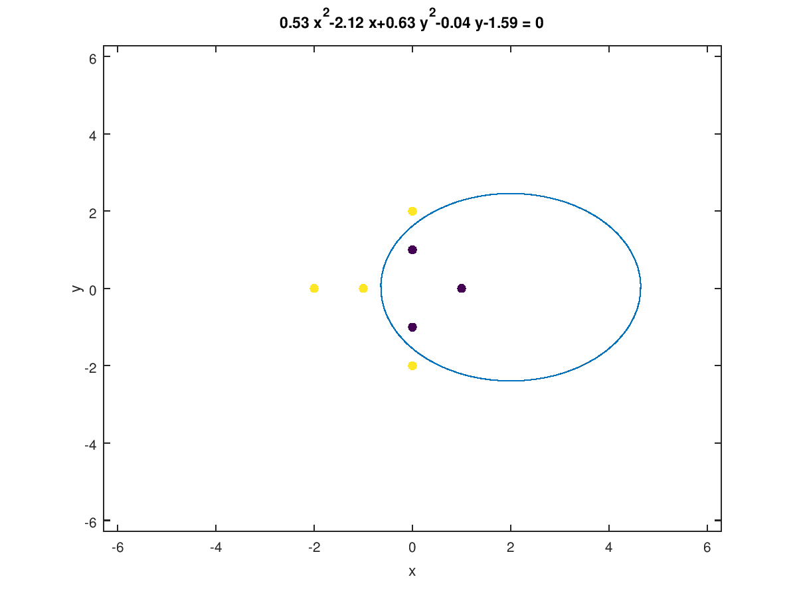

# ML-Techniques homework 1

作业请参考[这里](https://www.csie.ntu.edu.tw/~htlin/course/mltech17spring/hw1/hw1.pdf)

##Transform: Explicit versus Implicit

这里部分主要是关于数据的特征空间转换，包括显示转换和隐式转换。

1. 将特征转换过后的点在二维平面上如下：

   

   所以可以很清楚的看出在$Z$空间中最佳的分离面就是$x=4$，对应到$X$空间中方程为：

   $4x_1=x_2^2-3$

   可以看出是一个抛物线方程。在$X$空间中如下图所示：

   

   2. 第二问中使用隐式特征空间转换：$K(x,x')=(2+x^Tx')^2$

      需要对SVM的对偶问题使用二次规划进行求解得到最优化的**$\alpha$**. 使用上一问的7个点作为输入数据，已知SVM对偶问题形式如下：

      $min_{\alpha_i \ge 0} ( \frac{1}{2} \Sigma_i \Sigma_j \alpha_i \alpha_j y_i y_j x_i^T x_j  - \Sigma_i \alpha_i)$

      subject to: $\alpha_i \ge 0, for  1 \le i \ge N$

      二次规划的一般形式为：

      

      所以在此问题中，我们只要计算出H矩阵和q向量，就能通过matlab或者octave来求解。求解过程忽略得到最终的最优化$\alpha$向量为：

      $\alpha=[0,1.22,0.27,0.53,0.5,0.03,0]$

      对应到原来的数据中support vector(SV) = {x2,x3,x4,x5,x6}

      3. 我们求得最优化的$\alpha$就能得到primal问题中最优化的$w$和$b$, 再映射回$X$空间。方程为：

         $0.53x_1^2-2.12x_1+0.63x_2^2-0.04x_2-1.59=0$

         可以看出是一个椭圆方程。我们将数据点和该椭圆画在X空间使用如下Matlab代码

         ```matlab
         ezplot('0.53*x^2-2.12*x+0.63*y^2-0.04*y-1.59')
         hold on
         scatter(x(:,1),x(:,2),[],[0.1,0.1,0.1,0.7,0.7,0.7,0.7],'filled')
         ```

         图形如下：

         

         4. 比较上面显式和隐式两个特征变换，一种得到的是抛物线的分离面，另一种是椭圆的分离面。他们不一样的原因是使用了不同的特征转换。

##Dual Problem of  Soft-Margin SVM

